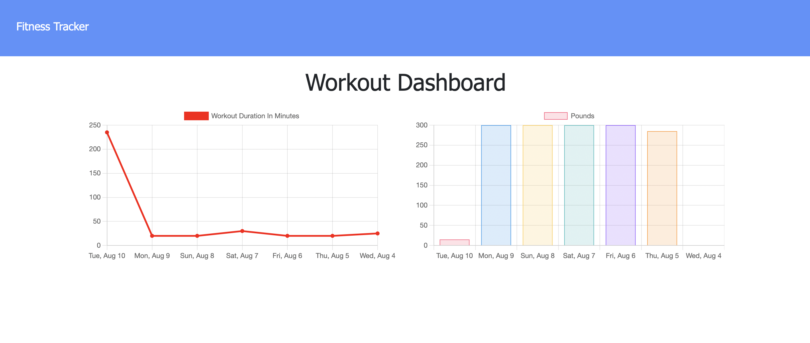
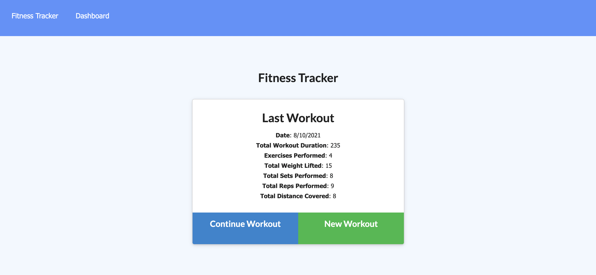

# Fitness-Tracker

## Heroku Deployment Link
  
  [Fitness Tracker App](https://warm-scrubland-57864.herokuapp.com/)

## Description: 
- For this task, I wanted to allow users to view and track daily workouts. As they add a new workout, the total duration of the exercises are added up for the day. 
- The reason I built this fitness tracker was to learn more about Mongoose and MongoDB.  
- This task helped me gain a better understanding of using the MongoDB and how to adjust to a NoSQL database.

## Dashboard:

## Tracker:

